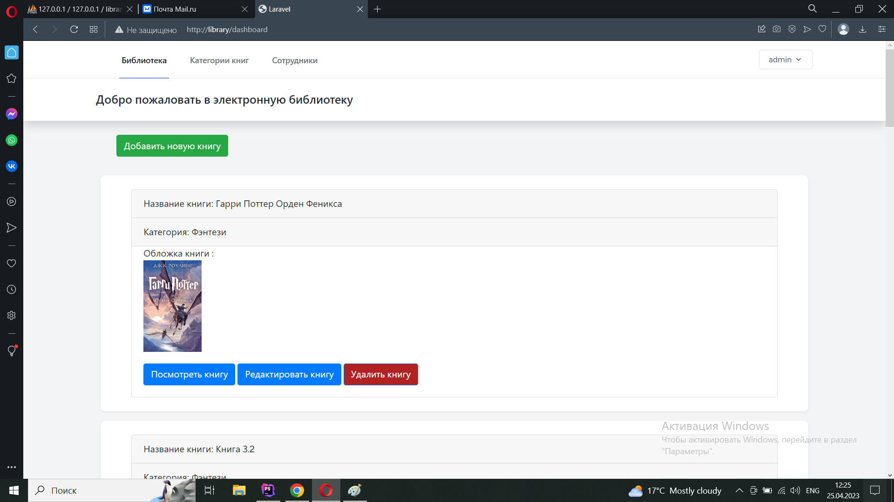

# Library
Тестовое задание для компании ООО "Медкорт"
## Описание
* Приложение включает : (Авторизацию + Регистрацию), две роли : 'worker', 'reader','admin. CRUD система для книг, категорий кнги, сотрудников.Регистрация только для читателей('reader').При авторизации нового читателя на email администратора прихоидт письмо с текстом 'Новый читатель {имя нового читатлея} зарегестрирован !'
# Для установки есть инструкция download-project instructions.txt, файл находится в папке "covers and env file"
# Авторизация

# Регистрация, только для читаталей, на регистрации устанавливается роль 'reader', после авторизации на почту администратора (second_em@mail.ru) приходит письмо

# Панель управления библиотекой для роли 'worker', для сотрудников есть возможность редактировать,удалять, создавать книги и категории книг

# Панель управления библиотекой для роли 'reader', читатели могу только просматривать и комментировать книги

# Если нет комментариев к кинге

# Панель управления библиотекой для роли 'admin', для администратора есть возможность редактировать,удалять, создавать книги и категории книг, а также CRUD для сотрудкников

# Окно с уведомление об удалении книги
